# Summary 

The DecisiOn sUpport weB plaTform (NO-DOUBT) aims to assist in
complicated multicriteria decision making problems, using the Analytic
Hierarchy Process (AHP). The AHP has been used around the world in a
wide variety of decision situations, in fields such as government,
business, industry,healthcare, education, project management
[@chan2006ahp],[@dede2010evaluation],[@drake1998using],[@lee2006investigating],[@liberatore2008analytic],[@saaty2003decision].

This application, extensively uses algorithms in order to solve a
multicriteria problem, calculating weights for each criterion, factors
(sub-criteria) that characterize the criteria, and the alternative
solutions of a target. This online application was implemented by using
PHP and HTML, an SQL database and Lapack libraries [@Lapack], which are
used to calculate eigenvalues and eigenvectors that help evaluating the
weights for each criteria, factors and alternatives.

The NO-DOUBT tool offers a web based interface in order to create a
survey, to determine a group of users who participate in the survey, to
collect responses, and export results. In this context, this platform
not only supports the AHP methodology but also the user administration,
the surveys development, the definition of decision making problems.
Each user has the opportunity to participate in a survey and view the
results of previous surveys. Towards this end, there are two different
interfaces, these of administrator and user with separate
functionalities. The tool’s implementation demonstrates the convenience
that a decision maker can conduct a survey through a decision-making
service, using simple data forms and programming structures.
Furthermore, through this service, materialized algorithms of
decision-making based on AHP are provided, in order to help finding the
optimal solution in a rapid and easy way.

This tool is a web based supporting tool for decision making that can be
helpful both for daily simple decision problems and complex decision
making problems in every day life, organizations, academia and
industries.

# Statement of Need 

Inspection of previous efforts reveals that there is a variety of tools
that support the AHP methodology either commercial or open source (OSS).

For example, super decisions software [@Superdecisions] is a free
educational software. It is the only free educational software that
implements AHP and was developed by the team of the creator of the
method, Thomas Saaty. Its development and maintenance is sponsored by
Creative Decisions Foundation. Moreover, the expert choice
[@Expertchoice] combine collaborative team tools and proven mathematical
techniques based on decision making methods such as the AHP. The
concluder [@Concluder] is a simple tool for complex decision making
using the consistency-driven pairwise comparisons method (CDPC) which is
primarily for multi-criteria decision making, such as the AHP. The
AHP-software [@AHP-Software] is also used to solve the AHP in decision
making and operation research. The spicelogic AHP Software
[@AHP_Software-30] captures the AHP methodology

Furthermore, open source software have been also developed for the AHP.
More specifically, the AHP-OS [@AHP-OS] is a free web based AHP tool for
decision making processes. The AHP with R [@AHP-R] is an R package to
model complex decision making problems using AHP. There are also other
efforts that suppoty part or the whole AHP algorithm such as
[@Paulgovan-ahp], [@Andrugo-ahp], [@Airiyu-ahp], [@Humberoroa-ahp], [@Pvlhx-ahp],
[@Hogivano-ahp].

Even though there are several software that support AHP there is no
single solution that offers a web based platform which both
administrator and user functionalities. Most of the already developed
AHP software integrate only the AHP algorithm. The NO-DOUBT tool
supports the development of surveys, the management of users
(registration, login) as well as the application of the AHP algorithm
with extraction functionalities for further use of the results. There
are many directions for future expansion of this tool. Towards this end,
the authors have already begun to incorporate their research
contributions in the field of decision making and more specifically, the
estimation of the probability of rank reversal in order to investigate
the stability of the final
outcomes[@dede2015convergence],[@dede2016theoretical].

# AHP Methodology 

AHP is a multi-criteria decision making methodology which adopts a
hierarchical form using three conceptual levels. In the first level, the
objective is defined (e.g. the evaluation of technologies for home
networking based on a set of alternative solutions). In the next level,
we identify a number of criteria $N$ on which our evaluation will be
based. Each criterion $C_k$ is an important aspect of the decision
making problem and is further identified by its factors at the third
level of the hierarchy. A factor $F_{j_k}$ is an indicative attribute
that characterizes a criterion (e.g., downstream throughput is a factor
of performance criterion for home networking technologies).

In order to rate the alternative solutions, one must first evaluate the
weights of the criteria $w_k$ and the factors $f_{j_k}$. Toward this
end, each expert $m$ performs a series of PWCs by filling out a table
containing the upper triangular elements based on a certain scale (e.g.
the nine level scale). The diagonal elements of the PWC are set equal to
one, while the lower triangular elements are calculated as the
reciprocal of the upper ones.

The criteria weights for the $m$ expert are obtained by the elements of
the eigenvector corresponding to the maximum eigenvalue of the PWC
matrix.

A similar procedure is followed for the estimation of the weights of the
factors $f_{jk}$ of each criterion. Finally, the alternatives are
pairwise compared according to each factor and for each alternative
$A_i$ one obtains the relative scores $S_{ijk}$ under factor $F_{jk}$.
The final ranking priorities $T_i$ of each alternative are evaluated by
multiplying the relative scores $S_{ijk}$ by the overall weight
$f_{j_k} · w_k$ of the corresponding factor as follows:

$$T_i=\sum_{k=1}^{N}\sum_{j=1}^{J_k}S_{ijk} f_{jk} w_k$$

# Functionalities 

The NO-DOUBT tool is user friendly with clear and easy to follow
procedures. The site is separated by user and administrator accounts.
The administrator can create, modify and delete surveys, assign users to
answer a survey and extract research results based on the user answers.
On the other hand a user can register and answer an assigned survey as
well as view his judgments and results.

# Administrator 

The administrator can find all the possible actions in a sidebar in his
main screen as presented below:

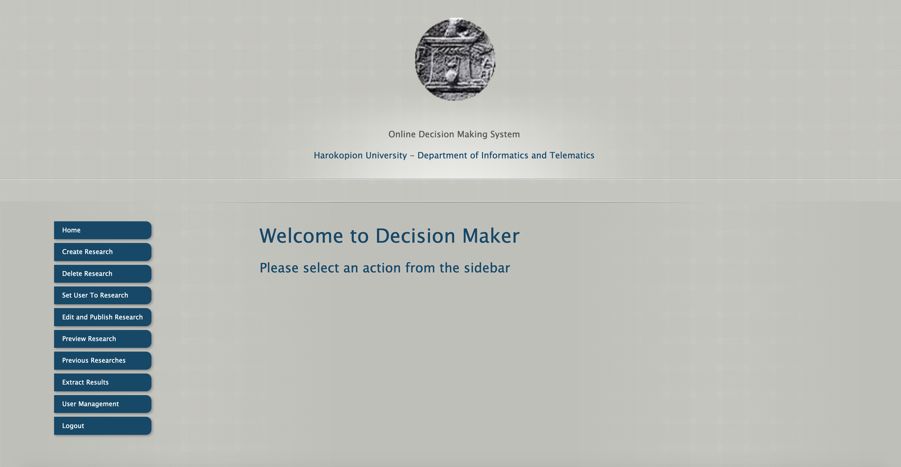

## Creating a Survey

The administrator will have to complete a series of simple forms for the
creation of a survey. The AHP methodology requires the survey to have at
least one criterion, at least one factor for each criterion and at least
one alternative. The administrator will have to provide the name and a
description for each element. The administrator can edit the survey
before publishing to users, by visiting the Edit and Publish Research
link in the sidebar.

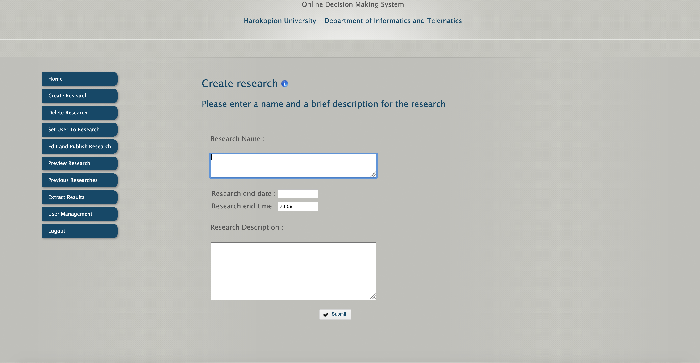
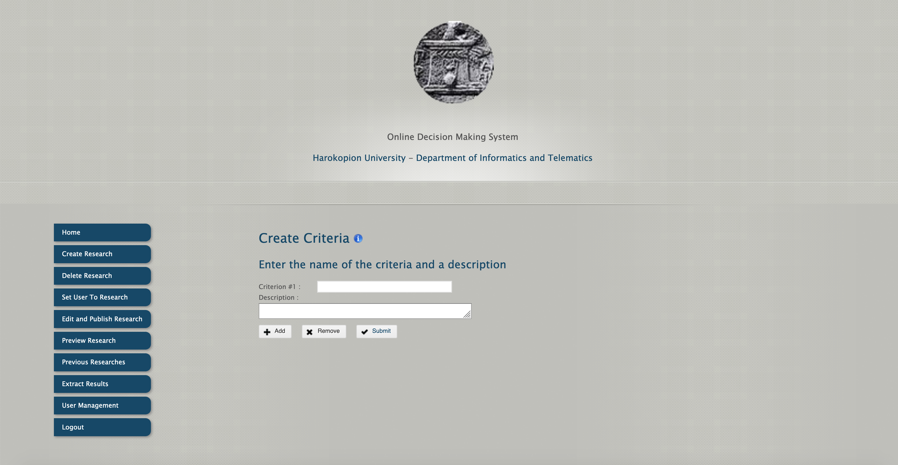

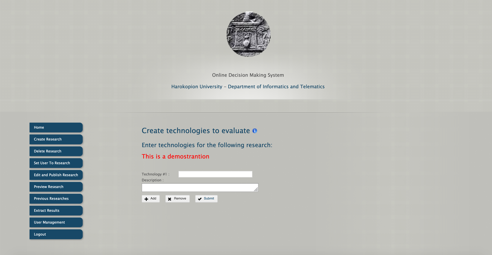

## Assigning to users and publishing for answers

When the survey is created, the next step is to assign users to fill in
the survey. This can be achieved by pressing the Set User to Research
button in the sidebar.

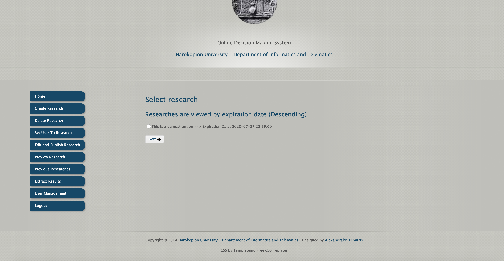

After that, we are ready to publish the survey. By clicking publish we
are letting the system know that the survey is ready to receive answers.
Once the survey is published it cannot be edited anymore. By default, a
survey is considered complete when the end date, during the creation of
the survey, has passed. The administrator has the possibility to
complete a survey prematurely by visiting the Edit and Publish Research.
When the survey is published a new button will appear that allows the
administrator to complete the survey.

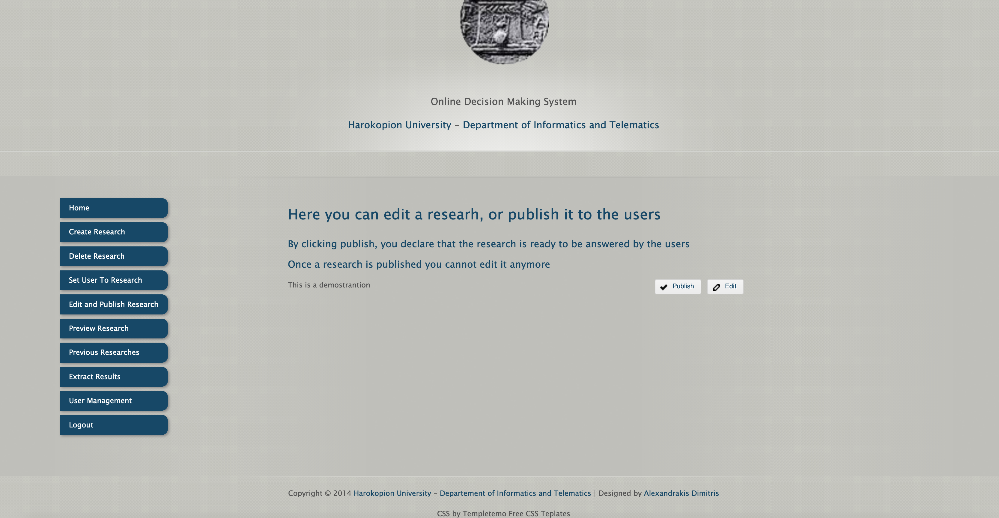

## Generating results of completed research

When a survey is complete, either by passing the end date, or manually
by the administrator, we can estimate and extract the results through
the Extract Results button in the sidebar. The list of surveys that have
been completed and results have not been extracted yet will be appeared.

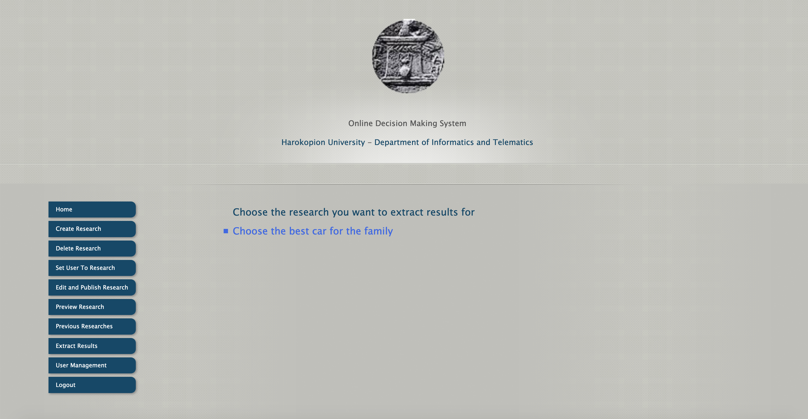

Clicking on the link the calculation of the eigenvalues and eigenvectors
will be performed for each user answer. Then based on the weights
derived from the eigenvectors, a ranking of the alternatives is
calculated and the final ranking is displayed on the screen, according
to the AHP.

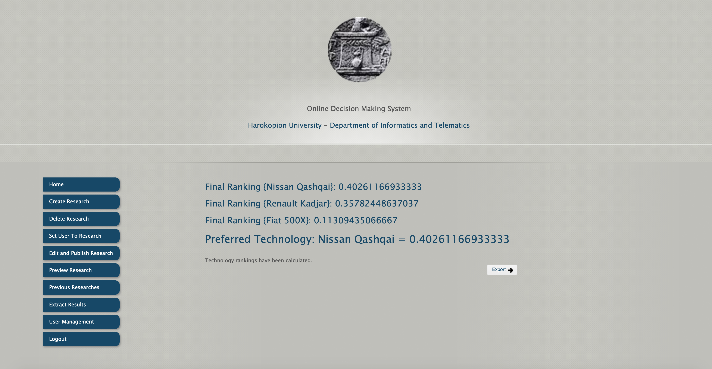

By clicking the Export button, we can get more detailed results in an
Excel file.

# User 

The user is more simplified than the administrator. A user is only able
to fill in an assigned survey and display previous results. For each
survey a user will have instructions on how to complete his answers via
a ranking system.

Example answers for an assigned survey are presented below.

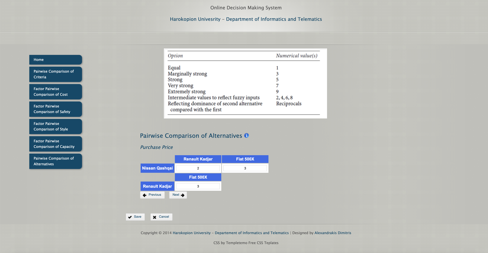
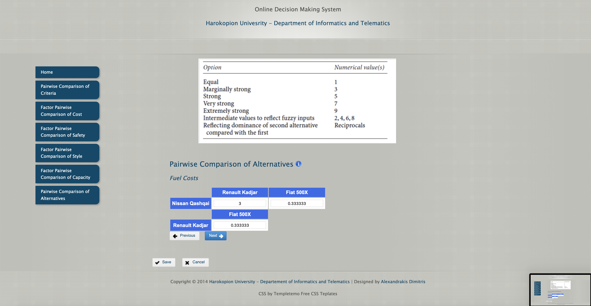
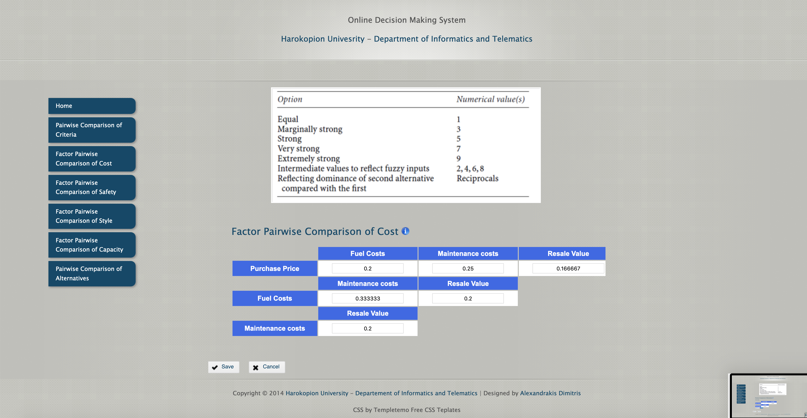

In the Completed Researches tab. The user will see a list of completed
researches. By clicking the link he will be able to download the results
of the research.

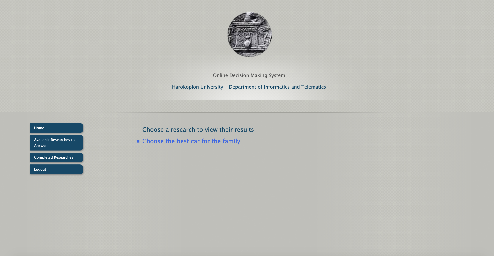

# References
